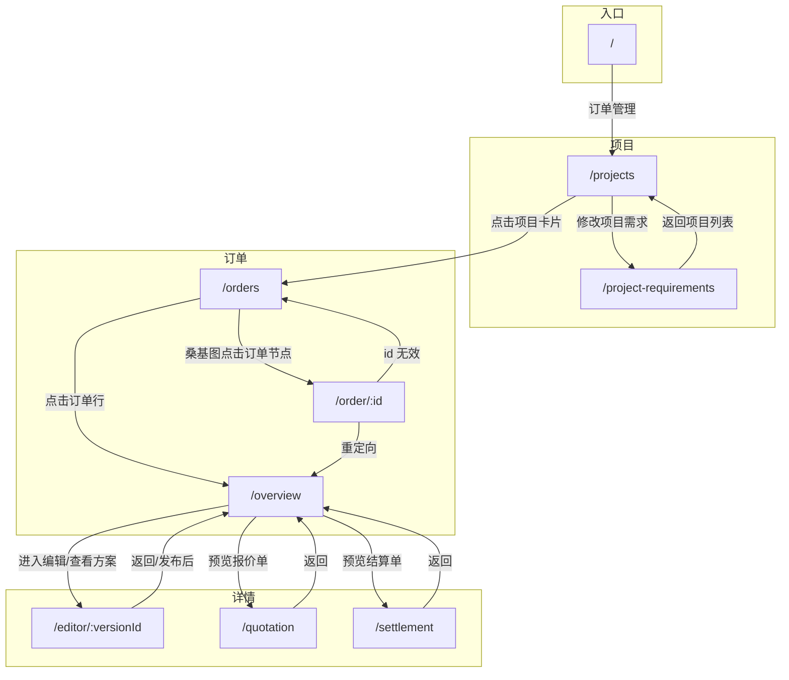

# Builder 端报价单与结算单 - 需求文档

## 1. 文档信息

| 项目 | 说明 |
| --- | --- |
| 文档名称 | Builder 端产品需求文档 (PRD) |
| 适用范围 | dspherebuilder_demo-main 项目 |
| 事实依据 | 基于当前代码实现与 `rules.md` 业务规则 |
| 更新日期 | 2026-03-19 |

---

## 2. 背景

### 2.1 产品概述

**一句话定义：**  
为 EPC 团队提供一个集 **自动同步、审核发布、反馈追踪、版本留存** 为一体的报价/结算管理工具。

**核心价值：**  
解决反馈滞后和数据不透明问题。Builder 端作为数据 **「中转审核站」**，确保对外数据的准确性，并保留完整的沟通与修改历史。

### 2.2 用户场景

EPC 团队在 PSO 完成工单编辑后，数据自动同步至 Builder。团队在 Builder 预览并审核（**Status: Draft**），确认无误后点击 **发布**。客户在 Home 端操作后，Builder 实时回显状态。

若需修改，EPC 在 PSO 调整，Builder 自动更新并生成新版本再次发布。

### 2.3 核心功能点

| 功能 | 说明 |
| --- | --- | 
| **A. 数据自动同步 (PSO → Builder)** | 后端与 PSO 实时/定时同步，PSO 数据变动后 Builder 自动渲染 |
| **B. 审核发布机制** | 默认待发布，Home 端不可见；EPC 点击发布后对客户可见 | 
| **C. 全链路反馈追踪 (Home → Builder)** | Builder 展示客户状态：未查看/已查看/已签字/已拒绝 | 
| **D. 多版本历史留存** | 每次发布固化为新版本，旧版本不覆盖，可追溯 | 

### 2.4 业务流程

1. **数据生成**：EPC 在 PSO 多维表格编辑数据。
2. **自动渲染**：Builder 自动抓取 PSO 数据并渲染，进入「待发布」状态。
3. **正式发布**：EPC 审核无误，点击「发布」，Home 端更新。
4. **客户交互**：客户在 Home 端签字或拒绝+留言。
5. **反馈闭环**：Builder 状态更新。若需迭代，重复步骤 1，系统自动生成 V2、V3 等历史版本。

---

## 3. 目标

### 3.1 业务目标

- EPC 在 Builder 端审核并发布报价单、结算单，客户在 Home 端可见并操作。
- 客户签字、拒绝、反馈后，Builder 端能实时回显状态。
- 每次发布固化为新版本，历史版本可追溯。

### 3.2  已实现能力

- **订单概览 (/overview) 三大核心功能**：方案编辑、订购报价单、交付结算单。
- **方案编辑器**：上传图片（含裁切）、标题/文字说明输入、打点注释、多页管理、客户评论展示。
- **订购报价单 / 交付结算单**：业务上数据来自飞书 PSO 多维表格，Builder 端审核发布；
- **项目需求书**：Builder 端编辑后发布至 Home 端，客户可确认/拒绝；修订历史留存。
- 桑基图资金流向视图，支持列表/桑基切换、阶段筛选、点击订单跳转。

---

## 4. 本次需求包含

### 4.1 订单概览 (/overview) 三大核心功能

订单概览页是 Builder 端的中枢，包含三个并列核心模块：

| 模块 | 数据来源 | 功能说明 |
| --- | --- | --- |
| **方案编辑** | Builder 端自建 | 项目重点功能：上传设计图纸、填写标题与文字说明、打点注释、多页管理；发布后客户在 Home 端审阅并反馈 |
| **订购报价单** | 飞书 PSO 多维表格 | 数据从 PSO 同步至 Builder，EPC 审核后发布给客户；客户签字/拒绝/反馈 |
| **交付结算单** | 飞书 PSO 多维表格 | 同上，交付阶段结算单的审核发布与反馈追踪 |

> 注：订购单、结算单的 PSO 同步在当前 demo 中为 Mock；方案编辑为 Builder 端完整实现。

### 4.2 已实现功能明细

| 模块 | 功能 | 说明 |
| --- | --- | --- |
| 仪表板 | 首页入口 | 订单管理卡片跳转至项目选择 |
| 项目选择 | 项目列表、修改需求入口 | 点击项目进订单列表，点击「修改项目需求」进需求书 |
| **项目需求书** | 表单编辑、发布至 Home、客户确认、修订历史 | Builder 修改后点击「确认修改并发布至Home端」，客户在 Home 端可同意/拒绝；|
| 订单列表 | 列表视图、搜索、阶段筛选 | 支持意向期/订购期/交付期/验收期/维保期筛选 |
| 桑基图 | 资金流向视图、点击跳转 | 自研 SVG 渲染，点击订单节点跳转 `/order/:id` → `/overview` |
| 订单概览 | 方案/报价/结算版本管理 | 新建、发布、模拟客户审阅/签字/反馈 |
| **方案编辑器** | 详见 4.3 | 上传图片、标题/文字说明、打点注释、多页管理、客户评论展示 |
| 报价单/结算单 | 详情展示、状态展示 | 未查看/已查看/已反馈/已签字状态展示 |

### 4.3 方案编辑器（重点功能）详细说明

方案编辑器 (`/editor/:versionId`) 是项目中的**重点功能**，支持 EPC 设计方案的完整制作与发布：

| 功能 | 说明 |
| --- | --- |
| **上传图片** | 支持上传设计图纸（≤10MB）；非 16:9 比例时自动弹出裁切弹窗，裁切后保存为页面主图 |
| **标题输入** | 每个页面可编辑标题（`page.title`），居中大号展示 |
| **文字说明输入** | 每个页面可编辑文字说明（`page.text`），限 150 字，用于方案描述 |
| **打点注释** | 点击「添加注释」后，在图片上点击打点标记位置；左侧「设计注释」卡片与图片上的点通过连线联动；支持编辑注释内容（限 150 字）、删除注释 |
| **多页管理** | 支持添加页面、切换页面（P1/P2/P3…）；新建页面继承上一版全部内容 |
| **客户评论展示** | 方案发布且客户审阅后，右侧展示「客户反馈参考」，含客户在图片或文字上的评论，与打点位置联动 |
| **图片缩放** | 点击图片可全屏缩放查看 |
| **发布** | 草稿状态下可点击「发布此版本」，状态变为已发布，客户可见 |

## 5. 核心概念

| 概念 | 定义 |
| --- | --- |
| **项目 (Project)** | 装修项目，含名称、编码，下挂多个订单 |
| **订单 (Order)** | 单个销售订单，有状态码（如 S00、S01）、标题、金额等 |
| **方案版本 (OrderVersion)** | 设计方案的一个版本，含多页图纸、标注、评论，状态为 draft / published_unread / reviewing / reviewed / historical |
| **报价单 (Quotation)** | 订购报价单，业务上数据来自飞书 PSO 多维表格，Builder 审核发布；状态为 draft / unread / read / feedback / signed |
| **结算单 (Settlement)** | 交付结算单，数据来源同上，Builder 审核发布；状态同上 |
| **项目需求书 (RequirementsDoc)** | 项目级需求文档，Builder 端编辑后发布至 Home 端，客户可同意/拒绝；含修订历史 |
| **发布 (Publish)** | 将 draft 单据/方案/需求书变为对客户可见，Builder 端点击「发布」后状态变更 |

---

## 6. 操作与跳转

### 6.1 仪表板

- **订单管理** → 进入项目选择页

### 6.2 项目选择

- **点击项目卡片** → 进入该项目的订单列表
- **修改项目需求** → 进入项目需求书编辑页

### 6.3 项目需求书

- **返回项目列表** → 回到项目选择
- **确认修改并发布至 Home 端** → Builder 修改需求书后，点击完成编辑弹窗中的「确认修改并发布至Home端」，内容发送至 Home 端供客户确认；客户可同意/拒绝，Builder 端展示 `customerStatus`（未读/已同意/已拒绝）

### 6.4 订单列表

- **列表视图 / 资金流向视图** → 切换展示方式
- **阶段筛选** → 按意向期/订购期/交付期/验收期/维保期过滤
- **点击订单行** → 进入订单概览
- **桑基图点击订单节点** → 跳转 `/order/:id`，再重定向至 `/overview` 并携带 order、project

### 6.5 订单概览

- **新建方案** → 继承最新版本，创建 draft（若已有 draft 则提示先发布）
- **发布方案** → draft → published_unread（不触发订单状态跳转）
- **新建报价单/结算单** → 创建 draft
- **发布报价单** → 若 S00 且首次发布 → S01；若 S02 且第二份发布 → S03
- **发布结算单** → 无订单状态跳转
- **进入编辑/查看方案** → 跳转 `/editor/:versionId`
- **预览报价单/结算单** → 跳转 `/quotation` 或 `/settlement`

### 6.6 方案编辑器

- **上传图纸** → 点击「上传图纸」或「更换图纸」，选择图片；非 16:9 时进入裁切弹窗
- **编辑标题/文字说明** → 在中间面板直接输入
- **打点注释** → 点击「添加注释」，再在图片上点击打点；左侧编辑注释内容
- **添加/切换页面** → 顶部 P1/P2/… 切换，点击 + 添加新页面
- **返回** → 回到订单概览
- **发布此版本** → 方案状态变为 published_unread，返回概览

### 6.7 报价单/结算单详情

- **返回** → 回到订单概览

---

## 7. 数据与状态

### 7.1 方案版本状态

| 状态 | 含义 |
| --- | --- |
| draft | 草稿，未发布 |
| published_unread | 已发布，客户未读 |
| reviewing | 客户审阅中 |
| reviewed | 客户已完成审阅 |
| historical | 历史版本 |

### 7.2 报价单/结算单状态

| 状态 | 含义 |
| --- | --- |
| draft | 待发布 |
| unread | 未查看未签字 |
| read | 已查看未签字 |
| feedback | 已查看已反馈 |
| signed | 已查看已签字 |

---

## 8. 路由与页面

### 8.1 路由表

| 路径 | 页面 | 说明 |
| --- | --- | --- |
| `/` | DashboardPage | 首页仪表板 |
| `/projects` | ProjectSelectionPage | 项目选择 |
| `/project-requirements` | ProjectRequirementsPage | 项目需求书 |
| `/orders` | OrderSelectionPage | 订单列表（支持列表/桑基切换） |
| `/order/:id` | OrderRedirect | 中转页，重定向至 `/overview` |
| `/overview` | OverviewPage | 订单概览（方案/报价/结算管理） |
| `/editor/:versionId` | EditorPage | 方案编辑器 |
| `/quotation` | QuotationPage | 报价单详情 |
| `/settlement` | SettlementPage | 结算单详情 |

`*` 未知路径重定向至 `/`。

### 8.2 页面跳转图

---

## 9. 订单阶段、状态与颜色

### 9.1 订单阶段说明

订单按业务阶段划分，共 5 个阶段：

| 阶段 | 颜色代码 | 包含状态 |
| --- | --- | --- |
| 意向期 | #d0d7d6 | S00, S01, S05 |
| 订购期 | #4887ff | S02, S02-01, S02-02, S03 |
| 交付期 | #B300FA | S06-01～S06-05, S13 |
| 验收期 | #ff9c3e | S07, S08, S09 |
| 维保期 | #7BC80E | S10, S11 |

终止/异常状态：S04（客户已婉拒）、S12（订单已结束）在 UI 中单独处理（红色/灰色）。

### 9.2 订单状态说明

| 状态代码 | 状态名称 | 业务含义 |
| --- | --- | --- |
| S00 | 意向报价中 | 订单刚创建，无设计方案与报价单 |
| S01 | 意向沟通中 | 客户收到设计报价单，未反馈 |
| S02 | 订单深化中 | 方案深化、详细图纸、精准报价 |
| S02-01 | 提案设计中 | 方案深化设计、详细图纸绘制 |
| S02-02 | 订购报价中 | 精准报价阶段 |
| S03 | 订购确认中 | 提交深化方案与精准报价，等待客户确认 |
| S04 | 客户已婉拒 | 客户不成交 |
| S05 | 客户决策中 | 客户迟迟未决策 |
| S06-01～S06-05 | 交付设计中/方案汇报中/交付备货中/交付施工中/交付内审中 | 交付各子阶段 |
| S07 | 订单验收中 | 提交竣工验收及结算单，等待确认 |
| S08 | 订单终止中 | 订单提前终止 |
| S09 | 订单整改中 | 客户有异议，内部整改 |
| S10 | 订单维保中 | 售后维修或保养 |
| S11 | 订单已交付 | 验收通过，结清尾款，正常完结 |
| S12 | 订单已结束 | 生命周期完全结束 |
| S13 | 订单休眠中 | 暂时停工 |

### 9.3 订单状态跳转说明（Builder 端）

Builder 端仅实现以下主动跳转：

| 触发动作 | 状态跳转 |
| --- | --- |
| 发布第一个报价单 | S00 → S01 |
| 发布第二个报价单（S02 系列） | S02 → S03 |
| 客户签字报价单（S01） | S01 → S02 |
| 客户签字报价单（S03） | S03 → S06-01 |
| 客户签字结算单（S07） | S07 → S11 |

其他状态（S04、S05、S06-X、S08 等）由服务端控制，Builder 端仅读取并显示。

---

### 9.4 订单使用颜色说明

| 用途 | 阶段 | 颜色代码 | 说明 |
| --- | --- | --- | --- |
| 订单状态 Badge | 意向期 | #d0d7d6 | S00, S01, S05 |
| | 订购期 | #4887ff | S02, S03 |
| | 交付期 | #B300FA | S06-X, S13 |
| | 验收期 | #ff9c3e | S07, S08, S09 |
| | 维保期 | #7BC80E | S10, S11 |
| | 终止/异常 | red / gray | S04, S12 |

颜色定义见 `src/utils/constants.ts`（ORDER_STATUS_CONFIG）与 `src/utils/orderStatus.ts`（STATUS_BADGE_COLORS）。

---

## 10. 桑基图颜色说明

### 10.1 阶段主色（订单节点）

| 阶段 | 颜色代码 | 常量 |
| --- | --- | --- |
| 意向期 | #d0d7d6 | STATUS_COLORS['意向期'] |
| 订购期 | #4887ff | STATUS_COLORS['订购期'] |
| 交付期 | #B300FA | STATUS_COLORS['交付期'] |
| 验收期 | #ff9c3e | STATUS_COLORS['验收期'] |
| 维保期 | #7BC80E | STATUS_COLORS['维保期'] |

定义于 `src/components/sankeyRules.ts` (`STATUS_COLORS`)。订单节点颜色由 `getOrderPhaseForColor(ord)` 根据 `statusCode` 映射到上述阶段。

### 10.2 预算柱颜色

| 用途 | 颜色代码 | 常量 |
| --- | --- | --- |
| 未入金部分 | #d0d7d6 | UNPAID_COLOR |
| 已入金部分 | #FBBF24 | INCOME_COLOR |

定义于 `src/components/BudgetSankeyWorkbench.tsx`。总预算柱为「未入金 | 已入金」渐变。

### 10.3 分组连线颜色

桑基图按三类预算分组（意向+订购 / 交付+验收 / 维保）：

| 分组 | 标签 | 颜色来源 |
| --- | --- | --- |
| groupA | 意向+订购 | STATUS_COLORS['意向期'] |
| groupB | 交付+验收 | STATUS_COLORS['验收期'] |
| groupC | 维保 | STATUS_COLORS['维保期'] |

连线从分组色渐变到订单色。

### 10.4 特殊规则

- **S04（客户已婉拒）**：桑基图中不展示

---

## 附录：验收标准（业务目标）

以下为业务目标验收标准，当前 demo 实现程度见第 4 节。

- **同步准确**：Builder 渲染内容需与 PSO 源数据 100% 对应。
- **发布可见性**：仅点击「发布」后，Home 端可见对应报价单/结算单。
- **版本一致性**：历史版本的数据和留言完整保存，不被新版本覆盖或删除。
- **反馈实时**：客户留言后，Builder 端反馈状态与留言内容即时更新。
